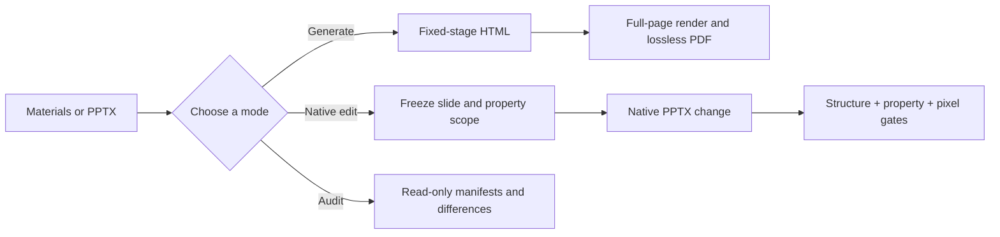

# Deck Forge

English | [中文](README.md)

**A delivery-oriented presentation skill that creates new decks and also edits, translates, compares, and verifies native PPTX files without rebuilding them.**

Deck Forge is more than a prompt for making attractive slides. It separates deck work into generation, native editing, and read-only audit modes, then applies executable quality gates to slide order, hidden backups, typography, translation, page numbers, object properties, and final renders.

## Contents

- What makes it different
- Three operating modes
- Installation
- Dependencies
- Example prompts
- Audit tools
- Repository layout
- Limitations and license

## What makes it different

### 1. Native PPTX preservation instead of screenshot rebuilding

For existing-PPTX tasks, Deck Forge preserves the native package, true slide order, hidden slides, layout/master relationships, and object geometry. A minimal-edit request is never silently rebuilt as HTML, PDF, or full-slide images.

### 2. Minimal change becomes enforceable

Many workflows can only say that “slide 7 changed.” Deck Forge can identify which property families changed:

- text and typography
- color and background
- geometry, grouping, and z-order
- media, charts, embedded data, and relationships
- notes, timing, hidden state, and order

[`audit_pptx_properties.py`](../scripts/audit_pptx_properties.py) applies a per-slide allowlist. Unauthorized, ambiguous, broad, or unused rules fail closed.

### 3. Hidden backups are verified, not merely present

[`audit_pptx_backups.py`](../scripts/audit_pptx_backups.py) compares a source slide with its hidden backup across text, style, geometry, shape order, and dependent images, charts, and notes. Rendered pages can also be mapped across different physical indices, such as source slide 3 versus hidden backup slide 50.

### 4. Translation includes structural completeness and copyfit

Translation mode builds a source-to-target mapping, checks title logic and text-box completeness, and treats automatic order fallback across different stable slide IDs as provisional. Exceptions must identify specific slides and boxes; broad wildcards cannot hide missing translations.

### 5. Page numbers, typography, and visual QA are full-deck checks

- Page-number auditing inspects slides, layouts, masters, placeholders, and native fields.
- Typography auditing resolves Latin/East Asian fonts, size, bold, inheritance, and suspicious names such as `????`.
- The PowerPoint/WPS renderer works from a scratch copy and verifies the source hash.
- Final QA covers every page rather than a sample.

### 6. Generation mode still has a real design system

Generation mode uses a fixed 1920×1080 HTML stage, visual style previews, 34 design templates, and lossless screenshot PDF export. The storyline comes from the supplied material; the skill does not fabricate facts to fill a layout.

## Three operating modes

| Mode | Use it for | Deliverable |
| --- | --- | --- |
| Generate | Create a new presentation from notes, documents, images, or a topic | HTML intermediate + lossless PDF |
| Native edit | Reformat, translate, copy-polish, or repair an existing PPTX | Native PPTX with preserved structure |
| Audit / compare | Compare versions, order, translation, typography, numbering, or renders | Read-only report; source files remain unchanged |



## Installation

### Codex

```powershell
git clone https://github.com/jiefeis/deck-forge.git "$env:USERPROFILE\.codex\skills\deck-forge"
```

### Claude Code

```bash
git clone https://github.com/jiefeis/deck-forge.git ~/.claude/skills/deck-forge
```

Agents with GitHub skill installation can install the repository root directly. The standard entry point is [`SKILL.md`](../SKILL.md).

## Dependencies

```bash
pip install playwright img2pdf lxml python-pptx Pillow
python -m playwright install chromium
python scripts/check_env.py
```

Native PPTX rendering uses PowerPoint or WPS COM on Windows. Most OOXML auditors use only the Python standard library; Pillow powers pixel audits and contact sheets.

## Example prompts

```text
Use deck-forge to restyle slides 5 and 8 using the reference slides' palette and typography.
Only background, color, and typography may change. Preserve every other slide and all object positions.
```

```text
Use deck-forge to compare the Chinese and English PPTX page by page.
Check translation completeness, box fit, and overflow. Treat the Chinese deck as the source of truth and edit English text boxes only.
```

```text
Use deck-forge to turn this Markdown brief into a 16:9 consulting deck and export a lossless PDF.
```

## Audit tools

```bash
# True order, hidden slides, shared parts, and translation structure
python scripts/audit_pptx_structure.py manifest deck.pptx
python scripts/audit_pptx_structure.py compare before.pptx after.pptx

# Property-level minimal change
python scripts/audit_pptx_properties.py before.pptx after.pptx --scope scope.json

# Hidden-backup identity
python scripts/audit_pptx_backups.py source.pptx final.pptx --map 3:50

# Page numbers and typography
python scripts/audit_pptx_page_numbers.py deck.pptx
python scripts/audit_pptx_typography.py deck.pptx

# Complete repository checks
python scripts/run_self_checks.py
```

See [`references/`](../references/) and [`SKILL.md`](../SKILL.md) for the complete workflows.

## Repository layout

```text
SKILL.md                 Skill entry point and routing
references/              Native-edit, translation, reformat, and visual-QA rules
scripts/                 Generation, rendering, and read-only audit tools
tests/                   Synthetic PPTX, PDF, HTML, and render regressions
bold-template-pack/      34 progressively loaded design templates
examples/                Reference HTML deck implementations
```

## Limitations and license

- PowerPoint, WPS, and LibreOffice may substitute fonts differently, so final rendering in the target application is still required.
- Screenshot PDFs are crisp but their body text is generally not selectable.
- Deck Forge does not grant redistribution rights for user-provided images, fonts, or client materials.

Deck Forge is released under the [MIT License](../LICENSE). See [`THIRD_PARTY_NOTICES.md`](../THIRD_PARTY_NOTICES.md) for bundled MIT components and attribution.
