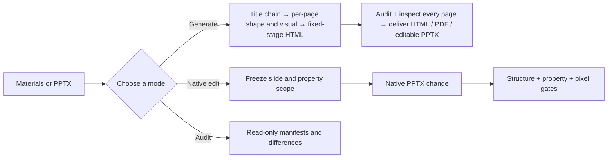

# Deck Forge

English | [中文](README.md)

[](https://github.com/jiefeis/deck-forge/actions/workflows/ci.yml)

**Make coding agents produce decks you can actually deliver: a storyline that holds, pages a reader understands without reasoning, and files that survive page-by-page verification.**

With this skill installed, an agent such as Claude Code or Codex changes how it builds a deck: it derives a title chain from the material before authoring any page, turns stacked text into visuals the reader does not have to decode, and removes the copy patterns that read as machine-written. On an existing PPTX it edits inside the native package, never rebuilds, and can prove afterwards that only the authorized properties changed. Before delivery every page is rendered, audited, and looked at.

## Contents

- Where deliveries actually fail, and what the skill does about it
- Three operating modes
- What a generation run looks like
- Installation
- Dependencies
- Example prompts
- Audit and export tools
- Repository layout
- Limitations and license

## Where deliveries actually fail, and what the skill does about it

| Failure | What Deck Forge does | Where the rule lives |
| --- | --- | --- |
| **Invented content**: numbers, customers, and conclusions made up to fill a template | Gaps stay empty or marked; page count follows the evidence; a deck that argues a case builds a title chain (pyramid / SCQA) that the user confirms before any page exists | [`AUTHORING.md`](../AUTHORING.md), [`references/storyline.md`](../references/storyline.md) |
| **Stacked text**: one explanation split into four equal cards, everything bold so nothing stands out | Recognize belonging, sequence, comparison, and handoff in prepared text and carry them with containers, conditioned arrows, dialogue mocks, ✓✗ ledgers, or proportional bars; falling back to text needs a reason too | [`references/text-to-visual.md`](../references/text-to-visual.md), [`LAYOUTS.md`](../LAYOUTS.md), [`references/consulting-diagrams.md`](../references/consulting-diagrams.md) |
| **Fake visuals**: icon grids and gradients posing as imagery | Each page gets a visual brief; real subjects get real photos or labeled concept illustrations; charts are drawn from data with geometry computed from values | [`references/visual-evidence.md`](../references/visual-evidence.md) |
| **AI-sounding copy**: flywheels, levers, closed loops, mechanical "not X but Y" | Rules distilled from real editor passes: shorter, concrete, about the work rather than the people; separate passes for client-facing diagnosis and BD pages | [`references/deck-copy-and-ai-slop.md`](../references/deck-copy-and-ai-slop.md) |
| **Damaged originals**: a "small edit" that silently rebuilds the deck and loses order, hidden slides, and master relationships | Native PPTX is edited inside its own package: slide and property scope is frozen first; property allowlists, hidden-backup comparison, and structural manifests prove only the authorized changes happened | [`references/edit-scope-contract.md`](../references/edit-scope-contract.md), [`references/pptx-native-editing.md`](../references/pptx-native-editing.md) |
| **Nobody looked at every page**: "tests pass" treated as delivery | Generated HTML passes a deterministic audit (clipping, offstage text, missing fonts, blank pages) and is then rendered and inspected page by page; PDF export is lossless and fails closed on font or asset errors; native PPTX is rendered through PowerPoint / WPS | [`scripts/audit_html_slides.py`](../scripts/audit_html_slides.py), [`references/visual-qa.md`](../references/visual-qa.md) |

Translation, page numbers, and typography — small things that break often — each get a full-deck audit: translation builds a source-to-target mapping and checks text-box completeness, page numbers are inspected down to layouts and masters, and typography resolves Latin / East Asian fonts, size, bold, and inheritance.

## Three operating modes

| Mode | Use it for | Deliverable |
| --- | --- | --- |
| Generate | Create a new presentation from notes, documents, images, or a topic | A single-file 1920×1080 HTML deck; on request a lossless PDF, or an editable PPTX via `export_pptx.py` |
| Native edit | Reformat, translate, copy-polish, or repair an existing PPTX; also author a mostly-new deck on the source's own masters, layouts, and theme | Native PPTX with preserved structure |
| Audit / compare | Compare versions, order, translation, typography, numbering, or renders | Read-only report; source files remain unchanged |


```mermaid
flowchart LR
    A[Materials or PPTX] --> B{Choose a mode}
    B -->|Generate| C[Title chain → per-page shape and visual → fixed-stage HTML]
    C --> D[Audit + inspect every page → deliver HTML / PDF / editable PPTX]
    B -->|Native edit| E[Freeze slide and property scope]
    E --> F[Native PPTX change]
    F --> G[Structure + property + pixel gates]
    B -->|Audit| H[Read-only manifests and differences]
```

The request picks the mode: an existing PPTX with "keep the original / minimal change / deliver PPTX" is Native edit; a PPTX used only as material for a new deck with HTML / PDF delivery accepted is Generate; report differences and change nothing is Audit. When the delivery format is unclear the skill asks instead of guessing.

## What a generation run looks like

1. **Intake**: pull materials and theme from the request; confirm only purpose, length, and density.
2. **Storyline**: for a deck that argues a case, produce the title chain first (one titled claim plus a one-line evidence note per page) and get it confirmed before any page; name each page's information shape and primary visual; text-heavy material goes through the text-to-visual pass.
3. **Style**: honor a given theme, otherwise generate three genuinely different preview slides (12 style presets plus 34 design templates) and let the user pick.
4. **Generate the HTML**: fixed 16:9 stage, one design system, real assets instead of placeholders.
5. **Verify**: deterministic audit, then render and inspect every page; export PDF only when requested and check it.
6. **Deliver and edit the words**: `edit_texts.py` extracts all deck text into one Markdown file; edit, apply, re-export.

The full procedure is in [`references/workflow.md`](../references/workflow.md); [`SKILL.md`](../SKILL.md) is the entry point and holds only triggers, non-negotiables, commands, and routing.

## Installation

### Codex

```powershell
git clone https://github.com/jiefeis/deck-forge.git "$env:USERPROFILE\.agents\skills\deck-forge"
```

Older Codex releases scan `~/.codex/skills` instead; clone there if you are on one.

### Claude Code

```bash
git clone https://github.com/jiefeis/deck-forge.git ~/.claude/skills/deck-forge
```

Agents with GitHub skill installation can install the repository root directly. The standard entry point is [`SKILL.md`](../SKILL.md).

If you download the GitHub ZIP instead, the extracted folder is named `deck-forge-main`; rename it to `deck-forge` — the skill name must match the directory name.

## Dependencies

```bash
pip install playwright img2pdf lxml python-pptx Pillow
python -m playwright install chromium
python scripts/check_env.py
```

`export_pptx.py diff` additionally needs `numpy`. Native PPTX rendering uses PowerPoint or WPS COM on Windows. Most OOXML auditors use only the Python standard library; Pillow powers pixel audits and contact sheets.

## Example prompts

```text
Use deck-forge to turn these meeting notes into a 16:9 consulting deck. Show me the title chain for confirmation first, then build the pages, and export a lossless PDF.
```

```text
Use deck-forge on this page: the text is stacked. Identify the belonging and sequence relationships first, then decide how to draw them — do not split it into more cards.
```

```text
Use deck-forge to remove the AI-sounding copy from this deck using the client-facing rules. Keep layout and facts unchanged.
```

```text
Use deck-forge to restyle slides 5 and 8 using the reference slides' palette and typography.
Only background, color, and typography may change. Preserve every other slide and all object positions.
```

```text
Use deck-forge to compare the Chinese and English PPTX page by page.
Check translation completeness, box fit, and overflow. Treat the Chinese deck as the source of truth and edit English text boxes only.
```

```text
Use deck-forge to turn the HTML deck it just generated into a PPTX I can edit.
```

## Audit and export tools

```bash
# Generated HTML deck: pre-export audit, lossless PDF, editable PPTX, text round-trip
python scripts/audit_html_slides.py deck/index.html
python scripts/export_pdf.py deck/index.html deck/deck.pdf
python scripts/export_pptx.py build deck/index.html deck/deck.pptx
python scripts/edit_texts.py extract deck/index.html   # edit deck/index.texts.md, then apply

# Native PPTX: true order, hidden slides, shared parts, translation structure
python scripts/audit_pptx_structure.py manifest deck.pptx
python scripts/audit_pptx_structure.py compare before.pptx after.pptx

# Property-level minimal change, hidden-backup identity, page numbers, typography
python scripts/audit_pptx_properties.py before.pptx after.pptx --scope scope.json
python scripts/audit_pptx_backups.py source.pptx final.pptx --map 3:50
python scripts/audit_pptx_page_numbers.py deck.pptx
python scripts/audit_pptx_typography.py deck.pptx

# Complete self-check (skill structure validation + every regression test)
python scripts/run_self_checks.py
```

## Repository layout

```text
SKILL.md                 Entry point: triggers, non-negotiables, commands, routing
AUTHORING.md             Source boundary, page sequence, visual system, fit, final trace
LAYOUTS.md               Information shape → composition
references/              17 rule files: storyline, text-to-visual, visual evidence, consulting
                         diagrams, AI-slop cleanup, source and scope contracts, native editing,
                         translation, reformat, visual QA, worked good/bad examples
scripts/                 Generation, export, rendering, and read-only audit tools (20)
tests/                   Synthetic PPTX / PDF / HTML and render regressions (19 suites)
evals/                   14 behavioral pressure scenarios: mode, scope, fabrication, hidden pages,
                         multi-source authority
bold-template-pack/      34 progressively loaded design templates
examples/                4 reference implementations: consulting diagrams, consulting visuals,
                         text editing, exporter stress sample
```

## Limitations and license

- PowerPoint, WPS, and LibreOffice may substitute fonts differently, so final rendering in the target application is still required.
- Screenshot PDFs are crisp but their body text is generally not selectable; to change words, go back to the HTML or export a PPTX with `export_pptx.py`.
- `evals/` are maintainer-run behavioral probes, not CI; the skill's actual effect on agent behavior has not been independently measured, and single-case rules in the reference files are marked as awaiting validation.
- Deck Forge does not grant redistribution rights for user-provided images, fonts, or client materials.

Deck Forge is released under the [MIT License](../LICENSE). See [`THIRD_PARTY_NOTICES.md`](../THIRD_PARTY_NOTICES.md) for bundled MIT components and attribution.
