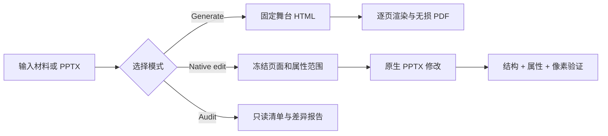

# Deck Forge

[English](README.en.md) | 中文

**面向真实交付的演示文稿技能：生成新 deck，也能在不破坏原文件的前提下精修、翻译、对比和验证原生 PPTX。**

Deck Forge 不只是“让 AI 做一份好看的 PPT”。它把演示文稿任务分成生成、原生编辑、只读审核三种模式，并为页序、隐藏备份、字体、翻译、页码、对象属性和最终渲染建立可执行的质量门槛。

## 目录

- 为什么特别
- 三种工作模式
- 安装
- 依赖
- 使用示例
- 审核工具
- 项目结构
- 限制与许可

## 为什么特别

### 1. 原生 PPTX 保真，而不是截图重做

当用户要求修改已有 PPTX 时，Deck Forge 会保留原生包结构、页面顺序、隐藏页、母版关系和对象几何。它明确禁止把“最小修改”偷偷转成 HTML、PDF 或整页图片重建。

### 2. “最小改动”可以被证明

普通流程往往只知道“第 7 页变了”。Deck Forge 可以继续判断第 7 页究竟改了什么：

- 文本与字体
- 颜色与背景
- 几何、分组和层级
- 图片、图表、嵌入数据与关系
- 备注、动画、隐藏状态和顺序

[`audit_pptx_properties.py`](../scripts/audit_pptx_properties.py) 使用逐页属性白名单，未授权或含糊的变化会直接失败。

### 3. 隐藏备份不是“看起来还在”

[`audit_pptx_backups.py`](../scripts/audit_pptx_backups.py) 会核对原页与隐藏备份的文本、样式、几何、形状顺序及关联的图片、图表和备注。渲染后还可以用跨页像素映射比较原第 3 页与备份第 50 页。

### 4. 双语翻译带结构和 copyfit 审核

翻译模式不仅检查语言，还会建立源页/目标页映射，核对标题逻辑和文本框完整性，并将不同 slide ID 的自动顺序回退视为风险。例外必须限定到具体页面和文本框，不能用全局通配符掩盖漏译。

### 5. 页码、字体和视觉 QA 都是全量检查

- 页码会检查 slide、layout、master 和原生字段，避免“26 + 7”式重复。
- 字体审计解析 Latin / East Asian 字体、字号、粗体和继承链，并识别 `????` 等乱码字体名。
- PowerPoint/WPS 渲染器在临时副本上工作并验证源文件哈希。
- 最终检查覆盖每一页，不以抽样代替交付证据。

### 6. 生成模式仍然重视设计

生成模式使用固定 1920×1080 HTML 舞台、风格预览、34 套设计模板和无损截图 PDF。内容结构来自用户材料，不会为了填满模板而编造数字或观点。

## 三种工作模式

| 模式 | 适用任务 | 交付物 |
| --- | --- | --- |
| Generate | 从大纲、文档、图片或主题生成新演示 | HTML 中间稿 + 无损 PDF |
| Native edit | 对已有 PPTX 做精修、翻译、reformat、页码或字体修复 | 保持原生结构的 PPTX |
| Audit / compare | 对比版本、顺序、翻译、字体、页码或渲染结果 | 只读报告，不修改源文件 |



## 安装

### Codex

```powershell
git clone https://github.com/jiefeis/deck-forge.git "$env:USERPROFILE\.codex\skills\deck-forge"
```

### Claude Code

```bash
git clone https://github.com/jiefeis/deck-forge.git ~/.claude/skills/deck-forge
```

也可以让支持 GitHub 技能安装的编码代理安装仓库根目录。标准入口是 [`SKILL.md`](../SKILL.md)。

## 依赖

```bash
pip install playwright img2pdf lxml python-pptx Pillow
python -m playwright install chromium
python scripts/check_env.py
```

原生 PPTX 渲染在 Windows 上使用 PowerPoint 或 WPS COM。大多数 OOXML 审核脚本只依赖 Python 标准库；Pillow 用于像素审计和 contact sheet。

## 使用示例

可以直接对代理说：

```text
使用 deck-forge，把这份 PPTX 的第 5、8 页改成参考页的配色和字体。
只允许改背景、颜色和字体，其他页面和对象位置必须保持不变。
```

```text
使用 deck-forge，逐页核对中英文 PPTX 的翻译、文本框完整性和文字溢出。
以中文版为准，只修改英文文本框。
```

```text
使用 deck-forge，把这份 Markdown 做成 16:9 的顾问汇报，并导出无损 PDF。
```

## 审核工具

```bash
# 真实顺序、隐藏页、共享部件和翻译结构
python scripts/audit_pptx_structure.py manifest deck.pptx
python scripts/audit_pptx_structure.py compare before.pptx after.pptx

# 属性级最小改动
python scripts/audit_pptx_properties.py before.pptx after.pptx --scope scope.json

# 隐藏备份身份
python scripts/audit_pptx_backups.py source.pptx final.pptx --map 3:50

# 页码和字体
python scripts/audit_pptx_page_numbers.py deck.pptx
python scripts/audit_pptx_typography.py deck.pptx

# 完整自检
python scripts/run_self_checks.py
```

详细流程见 [`references/`](../references/) 和 [`SKILL.md`](../SKILL.md)。

## 项目结构

```text
SKILL.md                 技能入口与路由
references/              原生编辑、翻译、reformat、视觉 QA 规则
scripts/                 生成、渲染和只读审核工具
tests/                   合成 PPTX、PDF、HTML 和渲染回归测试
bold-template-pack/      34 套渐进加载的设计模板
examples/                HTML deck 参考实现
```

## 限制与许可

- PowerPoint、WPS 和 LibreOffice 的字体替换可能不同，因此最终仍需用目标应用渲染。
- 截图 PDF 清晰但正文通常不可选择。
- Deck Forge 不会自动赋予输入素材的再发布权；用户仍需确认图片、字体和客户材料的许可。

Deck Forge 采用 [MIT License](../LICENSE)。第三方 MIT 组件及署名见 [`THIRD_PARTY_NOTICES.md`](../THIRD_PARTY_NOTICES.md)。
