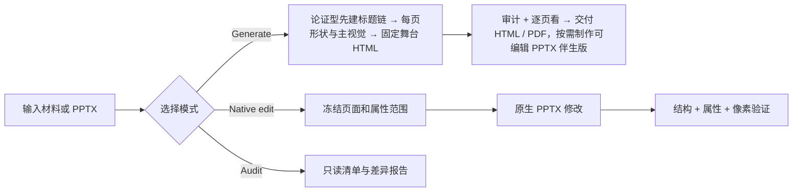

# Deck Forge

[English](README.en.md) | 中文

[](https://github.com/jiefeis/deck-forge/actions/workflows/ci.yml)

**让编码代理做出能交付的演示：故事线讲得通、画面看得懂、文件经得起逐页核对。**

给 Claude Code、Codex 这类代理装上这个技能之后，它会按任务选路径：论证型 deck 先从材料里立起标题链、确认后再做页；文字重的页面先识别关系再组织画面；需要打磨文案时按受众调整措辞。改已有 PPTX 时保留原生结构并核对授权范围；交付前逐页渲染、审计和查看。

## 目录

- 它解决交付里真正会翻车的地方
- 三种工作模式
- 一次生成大致怎么走
- 安装
- 依赖
- 使用示例
- 审核与导出工具
- 项目结构
- 限制与许可

## 它解决交付里真正会翻车的地方

| 会翻车的地方 | Deck Forge 怎么做 | 规则在哪 |
| --- | --- | --- |
| **编故事**：为了填满模板，凑出数字、客户、结论 | 交付必需事实缺失时先向用户确认，受影响内容保持草稿；已批准留待填写的内容明确占位，页数跟着证据走。论证型 deck 先建标题链（金字塔 / SCQA），用户确认后才做页 | [`AUTHORING.md`](../AUTHORING.md)、[`references/storyline.md`](../references/storyline.md) |
| **文字堆叠**：一段说明拆成四张等宽卡片，重点全加粗等于没加粗 | 从整理好的文字里认出归属、先后、比较、交接，转成容器、带条件的箭头、对话示意、勾叉表、比例条；退回文字也要有根据 | [`references/text-to-visual.md`](../references/text-to-visual.md)、[`LAYOUTS.md`](../LAYOUTS.md)、[`references/consulting-diagrams.md`](../references/consulting-diagrams.md) |
| **假视觉**：用图标阵列、渐变色块冒充"有图" | 每页先写视觉简报；实物、场景、案例去拿真图或生成并标注的概念图；图表从数据画，几何按数值算 | [`references/visual-evidence.md`](../references/visual-evidence.md) |
| **AI 味**：飞轮、抓手、闭环，排比句和"不是……而是……" | 按真实编辑稿蒸馏出的规则改文案：短、具体、对事不对人；客户面的诊断页和 BD 页各有一套 | [`references/deck-copy-and-ai-slop.md`](../references/deck-copy-and-ai-slop.md) |
| **改坏原文件**："小改一下"变成整份重做，页序、隐藏页、母版关系悄悄丢了 | 原生 PPTX 在自己的包里改：先冻结页面与属性范围，改完用属性白名单、隐藏备份比对、结构清单证明只改了授权的地方 | [`references/edit-scope-contract.md`](../references/edit-scope-contract.md)、[`references/pptx-native-editing.md`](../references/pptx-native-editing.md) |
| **没人逐页看**："测试通过"就交付 | 生成的 HTML 先过确定性审计（裁切、越界、缺字体、空白页），再逐页渲染看；PDF 无损截图且字体缺失即失败；原生 PPTX 用 PowerPoint / WPS 渲染每一页 | [`scripts/audit_html_slides.py`](../scripts/audit_html_slides.py)、[`references/visual-qa.md`](../references/visual-qa.md) |

翻译、页码、字体这些看起来琐碎却常出事的地方也各有全量审计：翻译建源页 / 目标页映射并核对文本框完整性，页码查到 layout 和 master，字体解析中西文、字号、粗体和继承链。

## 三种工作模式

| 模式 | 适用任务 | 交付物 |
| --- | --- | --- |
| Generate | 从大纲、文档、图片或主题生成新演示 | 1920×1080 HTML（按要求单文件，或连同本地资源目录）；按要求再出无损 PDF，或从 HTML 制作可编辑 PPTX 伴生版 |
| Native edit | 对已有 PPTX 做 reformat、翻译、文案打磨或修复；也包括在源 deck 自己的母版、版式和主题上新作一份 deck | 保持原生结构的 PPTX |
| Audit / compare | 对比版本、顺序、翻译、字体、页码或渲染结果 | 只读报告，不修改源文件 |


```mermaid
flowchart LR
    A[输入材料或 PPTX] --> B{选择模式}
    B -->|Generate| C[论证型先建标题链 → 每页形状与主视觉 → 固定舞台 HTML]
    C --> D[审计 + 逐页看 → 交付 HTML / PDF，按需制作可编辑 PPTX 伴生版]
    B -->|Native edit| E[冻结页面和属性范围]
    E --> F[原生 PPTX 修改]
    F --> G[结构 + 属性 + 像素验证]
    B -->|Audit| H[只读清单与差异报告]
```

模式由请求决定：已有 PPTX 且要"保留原样 / 小改 / 交 PPTX"→ Native edit；PPTX 只是新 deck 的素材、接受 HTML / PDF 交付 → Generate；只要报告差异、不改任何东西 → Audit。交付格式不明时先问，不猜。

## 一次生成大致怎么走

1. **摘材料和主题**，只追问目的、长度、密度。
2. **立故事线**：论证型 deck 先出标题链（每页一个带立场的标题 + 一行证据说明），用户确认后再动页；每页写清信息形状和主视觉，文字重的材料先过一遍"文字 → 画面"识别。
3. **定风格**：给了主题就用，没给就出 3 张真正不同的预览页让用户选（12 套风格预设 + 34 套设计模板）。
4. **生成 HTML**：固定 16:9 舞台，一套设计系统；图片真拿真做，不用占位。
5. **验证**：确定性审计 → 逐页渲染看 → 需要 PDF 再导出并检查。
6. **交付并改字**：`edit_texts.py` 把全部文字抽成一个 Markdown，改完写回、重新导出。

完整步骤在 [`references/workflow.md`](../references/workflow.md)；[`SKILL.md`](../SKILL.md) 是入口，只放触发条件、不可妥协项、命令和路由。

## 安装

### Codex

```powershell
git clone https://github.com/jiefeis/deck-forge.git "$env:USERPROFILE\.agents\skills\deck-forge"
```

### Claude Code

```bash
git clone https://github.com/jiefeis/deck-forge.git ~/.claude/skills/deck-forge
```

也可以让支持 GitHub 技能安装的编码代理直接安装仓库根目录。标准入口是 [`SKILL.md`](../SKILL.md)。

若通过 GitHub ZIP 下载，解压后的目录名是 `deck-forge-main`，须重命名为 `deck-forge`——技能 name 与目录名必须一致。

## 依赖

```bash
pip install playwright img2pdf lxml python-pptx Pillow
python -m playwright install chromium
python scripts/check_env.py
```

`export_pptx.py diff` 另需 `numpy`。原生 PPTX 渲染在 Windows 上使用 PowerPoint 或 WPS COM。大多数 OOXML 审核脚本只依赖 Python 标准库；Pillow 用于像素审计和 contact sheet。

## 使用示例

可以直接对代理说：

```text
使用 deck-forge，把这份会议纪要做成 16:9 的顾问汇报。先给我标题链确认，再做页；导出无损 PDF。
```

```text
使用 deck-forge，这页文字太堆了：先认出里面的归属和先后关系，再决定怎么画，不要再拆成卡片。
```

```text
使用 deck-forge，这份 deck 的文案 AI 味太重，按客户面的规则改一遍，版式和事实不动。
```

```text
使用 deck-forge，把这份 PPTX 的第 5、8 页改成参考页的配色和字体。
只允许改背景、颜色和字体，其他页面和对象位置必须保持不变。
```

```text
使用 deck-forge，逐页核对中英文 PPTX 的翻译、文本框完整性和文字溢出。
以中文版为准，只修改英文文本框。
```

```text
使用 deck-forge，把刚生成的 HTML deck 变成能改字的 PPTX。
```

## 审核与导出工具

```bash
# 生成的 HTML deck：导出前确定性审计；无损 PDF；可编辑 PPTX；改字回流
python scripts/audit_html_slides.py deck/index.html
python scripts/export_pdf.py deck/index.html deck/deck.pdf
python scripts/export_pptx.py build deck/index.html deck/deck.pptx
python scripts/edit_texts.py extract deck/index.html   # 改完 deck/index.texts.md 后 apply

# 原生 PPTX：真实顺序、隐藏页、共享部件和翻译结构
python scripts/audit_pptx_structure.py manifest deck.pptx
python scripts/audit_pptx_structure.py compare before.pptx after.pptx

# 属性级最小改动、隐藏备份身份、页码和字体
python scripts/audit_pptx_properties.py before.pptx after.pptx --scope scope.json
python scripts/audit_pptx_backups.py source.pptx final.pptx --map 3:50
python scripts/audit_pptx_page_numbers.py deck.pptx
python scripts/audit_pptx_typography.py deck.pptx

# 完整自检（技能结构校验 + 全部回归测试）
python scripts/run_self_checks.py
```

## 项目结构

```text
SKILL.md                 技能入口：触发、不可妥协项、命令、路由
AUTHORING.md             源边界、页面序列、设计系统、装不下时怎么办、最终核对
LAYOUTS.md               信息形状 → 版式
references/              17 份规则：故事线、文字→画面、视觉证据、咨询图表、去 AI 味、
                         源文件与范围合同、原生编辑、翻译、reformat、视觉 QA、示例对照
scripts/                 生成、导出、渲染和只读审核工具（20 个）
tests/                   合成 PPTX / PDF / HTML 和渲染回归测试（19 组）
evals/                   14 个行为压力场景：模式、范围、编造、隐藏页、多源权威
bold-template-pack/      34 套渐进加载的设计模板
examples/                4 个参考实现：咨询图表、咨询视觉、文字编辑、导出压力样本
```

## 限制与许可

- PowerPoint、WPS 和 LibreOffice 的字体替换可能不同，最终仍需用目标应用渲染。
- 截图 PDF 清晰但正文通常不可选择；要改字请回到 HTML 或用 `export_pptx.py` 出 PPTX。
- `evals/` 是维护者手动跑的行为探针，不在 CI 里；技能对代理行为的实际改善幅度尚未做独立评测，单次案例不能证明普遍效果。
- Deck Forge 不会自动赋予输入素材的再发布权；用户仍需确认图片、字体和客户材料的许可。

Deck Forge 采用 [MIT License](../LICENSE)。第三方 MIT 组件及署名见 [`THIRD_PARTY_NOTICES.md`](../THIRD_PARTY_NOTICES.md)。
